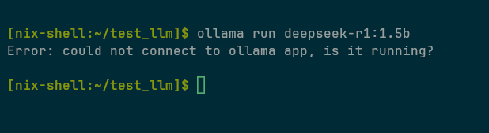
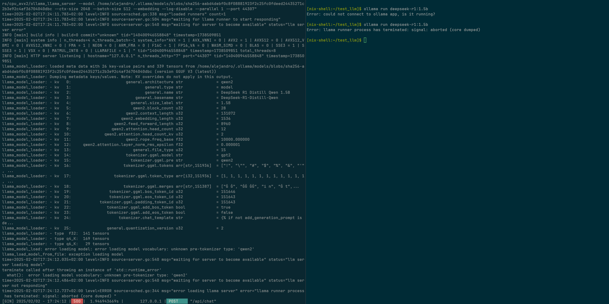
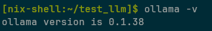
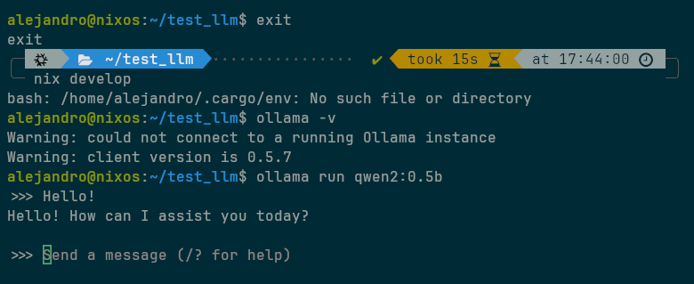

After the recent announcements of DeepSeek-R1, a Chinese-developed AI that seems to compete with the industry's most advanced models, I inevitably had some curiosity on what is going on. Of course, these new models are not the panacea to the energetic, social and ethical issues that plague the current AI movement. But as a scientist I wanted to give it a try without bias to make my own opinion on the topic.

The first thing I had to do was figure out how to run an AI model. My basic knowledge about the field ended at the existance of the popular interfaces for LLMs, that is ChatGPT or...honestly, that's about it. I have not been following or really interested in what has been happening so I had no idea how to run these models locally and privately. After a bit of googling around, `ollama` seemed to be the best choice to start with. It seems to be a Go frontend which uses a C++ backend called `llama.cpp` to execute the code and whatnot.

So I naively thought I would just try it, and be done with it. As always, I started by executing one of my favourite shell commands, `nix-shell -p ollama`, and quickly test it in a temporary development environment. What can I say, I love Nix. However, that was when I realized it was not going to be so easy.

After dropping me in my new shell with `ollama` installed, the official documentation prompted me to execute `ollama run deepseek-r1:1.5b`. But that did not work out so well, did it?

 
Well, NixOS can be like this. Besides, I do not really have a a GPU that can run things in this laptop. But I was curious, why is this happening? It did say that the `ollama` app is not running. Am I missing some step in the process? A quick rundown through the documentation to [run it manually in Linux](https://github.com/ollama/ollama/blob/main/docs/linux.md) revealed the answer. It seems the most basic setup is to have two terminals side by side, one serving `ollama` and the other one running the model.

Unfortunately that is not enough.

 
Well, that did not work out. Some thoughts came to mind afterwards.

1. Can I run other models?
2. What can I learn from the logs?
3. Is my version of `ollama` good enough?

I decided to first try a simpler model, one that did not use a lot of space. If very simple models do not work, why should I even bother with a state-of-the-art one, after all. Looking at the available models in the website, `Qwen2` has a small model with half a billion parameters (apparently that's the meaning of the numbers, as I learnt) which is only a few hundred MB. So I tried that. And it turned out the same.

After looking at the logs, this revealed something interesting.


```
llama_model_load: error loading model: error loading model vocabulary: unknown pre-tokenizer type: 'qwen2'
llama_load_model_from_file: exception loading model
time=2025-02-02T17:24:12.035+02:00 level=INFO source=server.go:540 msg="waiting for server to become available" status="llm server loading model"
terminate called after throwing an instance of 'std::runtime_error'
  what():  error loading model vocabulary: unknown pre-tokenizer type: 'qwen2'
time=2025-02-02T17:24:12.486+02:00 level=INFO source=server.go:540 msg="waiting for server to become available" status="llm server not responding"
time=2025-02-02T17:24:12.737+02:00 level=ERROR source=sched.go:344 msg="error loading llama server" error="llama runner process has terminated: signal: aborted (core dumped) "
```

Unknown pre-tokenizer type `qwen2` is an exception for both of the models I tried to run. For `qwen2` the answer was obvious, and a look at the `ollama` page for the DeepSeek model revealed that the model that I was trying to execute is actually derived, or distilled whatever that means, from a `Qwen2` model. Since the pre-tokenizer is unknown, my suspicions went on to making sure `nixpkgs` is using a recent version of `ollama`.

It was not.

 

## Making a flake

Now that we had found a lead, it was clear that the current nixpkgs channel I was using was not good enough. So I decided to make the quickest, dirtiest unstable flake known to humankind.

```nix
{
  description = "A quick unstable ollama shell";

  inputs = {
    nixpkgs.url = "github:nixos/nixpkgs?ref=nixos-unstable";
  };

  outputs = { self, nixpkgs }:
    let pkgs = nixpkgs.legacyPackages.x86_64-linux;
    in
    {
    devShells.x86_64-linux.default = pkgs.mkShell{
      name = "ollama";
      buildInputs = [
        pkgs.ollama
      ];
    };
  };
}
```
Running `nix develop` put me in a shell with `ollama 0.5.7` which is, at the time of writing this post, the latest version available on GitHub. Progress! Now let's try to have a side-by-side terminal with a server and run the same cheap `qwen2` model.

 

Heck yes! This is a terrible solution so far, but as starting point now we can run models based on `qwen2`. Let's ask a technical question to this 1.5b model and see what comes out. One of my interests for the past couple years has been on `Gaussian Process`, which hopefully I'll get around writing about sometime in the future. So let's ask what it knows about them.

> [!success]- Output of the LLM
> ```
> <think>
>
> Alright, the user is asking about Gaussian Processes. I should start by providing a clear and concise overview that's easy to understand.
>
>First, I'll define what a Gaussian Process (GP) is in simple terms. Then, I can explain its key properties and how it works. It might also be helpful to include some
>practical applications so the user understands why GPs are useful.
>
>I should avoid too much jargon and keep the explanation understandable for someone who may not have a strong background in machine learning or statistics.
>
>Let me structure this step by step:
>1. Define Gaussian Processes.
>2. Explain their key characteristics.
>3. Describe how they work.
>4. Mention some common applications.
>
>That should cover what the user is asking for without overwhelming them with technical details.
></think>
>
>Sure! A **Gaussian Process (GP)** is a powerful probabilistic model used in machine learning and statistics to model functions, making it particularly useful for
>regression tasks where you want to predict outputs based on inputs. Here’s a simple explanation:
>
>### What is a Gaussian Process?
>
>A Gaussian Process is a collection of random variables—each corresponding to a particular input point—that form a stochastic process. This means that any finite
>number of these random variables have a joint distribution that is multivariate normal (Gaussian). The key feature of GPs is their ability to model distributions over
>functions, which allows for uncertainty in predictions.
>
>### Key Characteristics
>
>1. **Non-parametric**: Unlike traditional regression models like linear regression or neural networks, GPs don’t assume a specific form for the function mapping
>inputs to outputs. Instead, they learn the relationship directly from the data.
>
>2. **Probabilistic Predictions**: A GP can predict not just a single output value but also provide uncertainty around that prediction. This is particularly useful in
>scenarios where you need to quantify confidence in predictions.
>
>3. **Kernel Functions**: GPs typically use a kernel function (also called a covariance function) to define the similarity between inputs. The choice of kernel
>determines the properties of the functions the GP can model, such as smoothness or periodicity.
>
>### How Does a Gaussian Process Work?
>
>1. **Define a Mean Function**: This is a deterministic function that specifies the expected value for each input point. Often, this is simply a constant (like zero),
>but it could be more complex depending on your data.
>
>2. **Define a Kernel Function**: The kernel defines how inputs are related to each other and can capture patterns in the data. Common kernel functions include:
>   - **Squared Exponential** or **Rational Quadratic** kernel: captures smoothness.
>   - **Matérn kernel**: models differentiability based on the distance between points.
>   - **Periodic kernel**: captures periodic patterns.
>
>3. **Random Function**: Using the mean and kernel functions, you generate a random function that passes through all your training data points. Each new input point is
>associated with a sample from this random function, which gives rise to uncertainty in predictions.
>
>### Common Applications
>
>Gaussian Processes are used in various applications where uncertainty quantification is important:
>
>1. **Regression**: Predicting continuous values (e.g., stock prices, temperature).
>2. **Classification**: Although GPs are primarily for regression, they can be adapted for classification by using appropriate kernel functions and post-processing
>techniques.
>3. **Active Learning**: Selecting which data points to label next based on uncertainty estimates.
>4. **Bayesian Optimization**: Optimizing black-box functions (e.g., tuning machine learning hyperparameters).
>
>### Summary
>
>A Gaussian Process is a flexible, probabilistic model that can learn complex relationships from data while providing uncertainty estimates. By combining flexibility
>with probability, GPs are particularly effective for tasks where you need to account for uncertainty in predictions.
>
>Let me know if you'd like further clarification or have specific questions!
>```

That was a long answer, and at first glance I do not see anything obviously wrong. So that looks promising. It did take quite some time for the final answer to form, likely due to my laptop's honestly lacking hardware requirements. A thinkpad from almost a decade ago is definely not in the frontier of hardware capabilities. But we did get it working!

It is, at this point, not satisfactory to me however. The first immediate issue is that I need to run several shells in parallel to get it working. A quick glance at the `NixOS` documentation reveals that there is a service I can quickly turn on if I wanted. But this will not work for me.

- The flake will not really be usable by itself.
- I will have this heavy service running on the background even after my tests are done.
